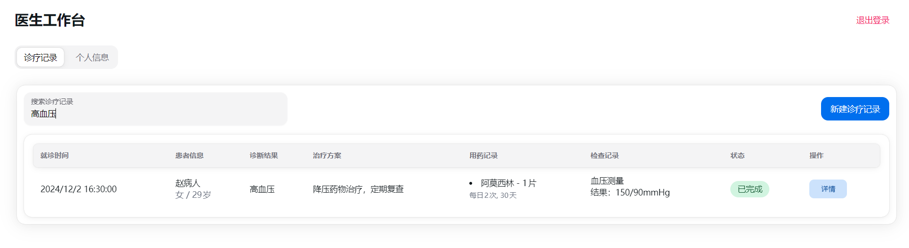
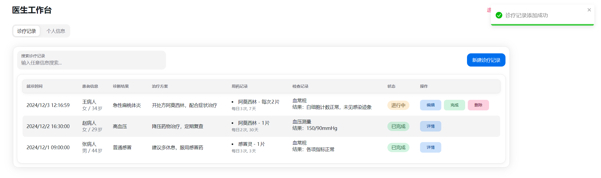
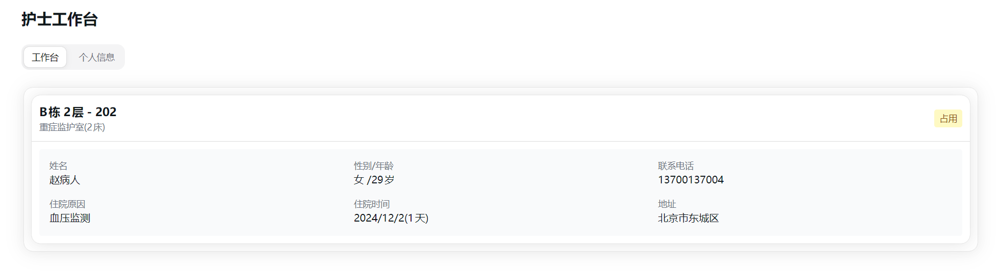
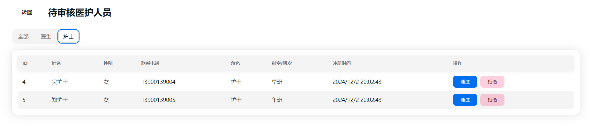
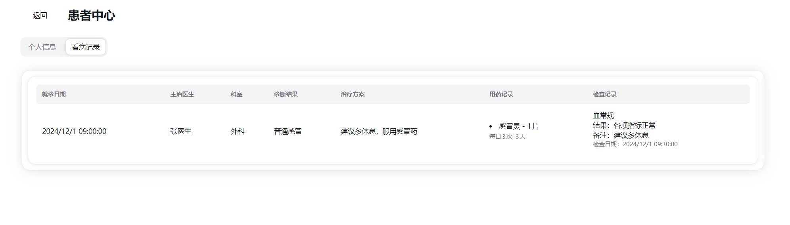
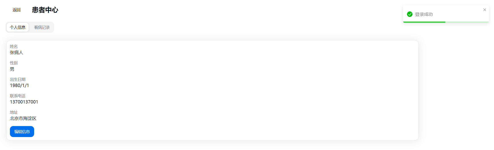

# Cursor 实战

> 1 天编写 1 万行代码

# 效果展示

## 医生后台

### 诊疗记录筛查

### 诊疗记录详情

### 诊疗记录新增

### 诊疗记录存档

## 护士后台

### 被分配的病房和患者信息

## 管理员后台

### 科室管理

### 病房管理

### 医护审核

### 医护管理

## 患者后台

### 看病记录

## 注册界面

